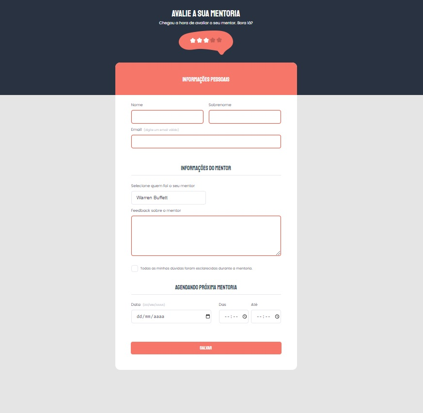

# Desafio do nível 03 avançado - Formulários

> Trilha Explorer 

> Projeto feito para cumprir desafio do nível 03 avançado construído no curso Explorer da Rocketseat :rocket:. 

## :hammer_and_wrench: Tecnologias

- HTML
- CSS
- Git e Github

## :nut_and_bolt: Neste projeto aprendi

- Formulários
- Semântica em HTML
- Box Model
- Acessibilidade
- Tags semanticas
- Entidade que regulamenta a semantica no Brasil [W3C](https://www.w3c.br/Padroes/WebSemantica)
- Conceito da programação chamado <b>REFATORAÇÃO</b>: mudar algo interno na página sem estragar o que esta funcionando, é feito com a intenção de melhorar algo interno no código do site.

- Trabalhamos com alinhamento e espaçamento dos elementos

- Pseudo classes

- Background: criando elementos com ::after e ::before
- Analizar um projeto com designe feito no Figma;
- Usar fontes do Google Fonts;
- Posicionar os elementos na tela usando a propriedade <strong>position: relative</strong>;
- Posicionar os elementos na tela usando a propriedade <strong>position: absolut</strong>;
- Validação com CSS

## :mailbox_closed: Contatos

> Email - rosendc30@gmail.com

> Linkedin - https://www.linkedin.com/in/francisco-rosendo-a05623241/
